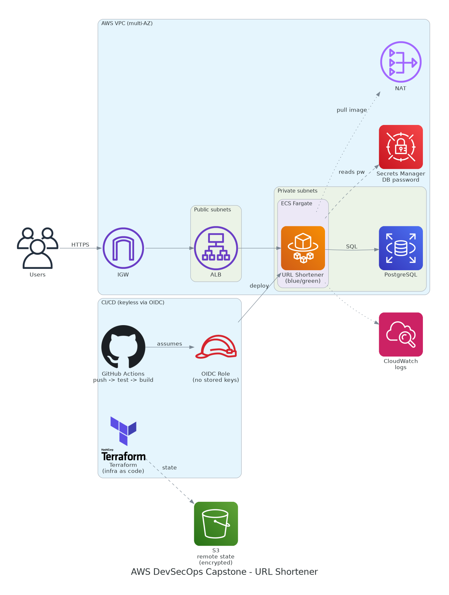
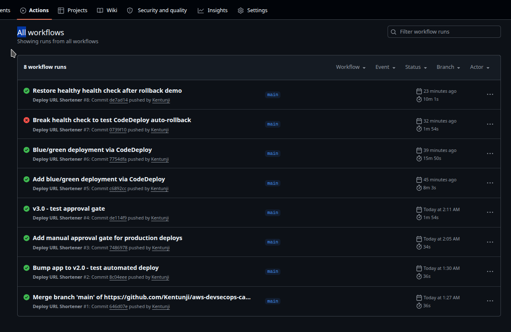

# AWS DevSecOps Capstone — URL Shortener

A production-grade, fully reproducible AWS deployment of a real application, provisioned
entirely as code with Terraform and shipped through a secure CI/CD pipeline with a
manual production approval gate.



---

## What this is

A **URL shortener** API: submit a long URL, receive a short code; visiting the code
redirects to the original. The application is deliberately small so the **infrastructure
and delivery pipeline** are the focus — but it is real enough that every component earns
its place (it needs a database, a private network, an API, and automated delivery).

Live request path: `Users → HTTPS → ALB (public subnets) → ECS Fargate (private subnets) → PostgreSQL`

---

## Highlights

- **Infrastructure as Code** — the entire environment is defined in Terraform and can be
  destroyed and rebuilt identically on demand.
- **Keyless CI/CD** — GitHub Actions authenticates to AWS via OIDC, assuming a
  least-privilege IAM role scoped to this repository. No long-lived AWS keys are stored
  anywhere.
- **Secrets handled correctly** — the database password is generated automatically, stored
  in AWS Secrets Manager, and injected into the container at runtime. It never appears in
  the source code or in version control.
- **Manual production approval gate** — code is built and tested automatically on push,
  then waits for explicit human approval (a GitHub Environment with required reviewers)
  before deploying to production.
- **Immutable, traceable images** — every build is tagged with its git commit SHA, so the
  running version is always traceable to an exact commit and deployments are deterministic.
- **Secure remote state** — Terraform state lives in an encrypted, versioned, private S3
  bucket with state locking, rather than on a local disk.
- **Defence in depth** — application tasks and the database run in private subnets with no
  inbound internet access; only the load balancer is public, and security groups restrict
  traffic to the minimum required path.

---

## Architecture

| Layer | Component | Purpose |
|-------|-----------|---------|
| Network | VPC, 2 public + 2 private subnets across 2 AZs, IGW, NAT | Multi-AZ isolation; public front door, private workloads |
| Compute | ECS Fargate service behind an Application Load Balancer | Runs the containerised API; ALB is the single public entry point |
| Data | RDS PostgreSQL in private subnets | Persists the short-code to URL mappings |
| Secrets | AWS Secrets Manager | Stores the DB password; injected into the task at runtime |
| CI/CD | GitHub Actions + OIDC + ECR | Build, test, and deploy on push with no stored credentials |
| Governance | GitHub Environment with required reviewers | Manual approval before production deploys |
| State | S3 (encrypted, versioned, locked) | Secure, shared Terraform state |
| Observability | CloudWatch Logs | Container log aggregation |

---

## CI/CD pipeline

On every push to `main` that touches the application:

1. **Test** — runs the unit tests. A failure stops the pipeline; nothing is deployed.
2. **Authenticate** — assumes the deployment IAM role via OIDC (keyless).
3. **Build & push** — builds the Docker image, tags it with the commit SHA, pushes to ECR.
4. **Approval gate** — the deploy job pauses and waits for a reviewer to approve in GitHub.
5. **Deploy** — registers a new ECS task definition with the new image and updates the
   service.

```
git push → test → build (SHA tag) → push to ECR → [⏸ approve] → blue/green deploy → auto-rollback if unhealthy
```

---
## Pipeline in action



Every push runs through build, test, manual approval, and a blue/green deployment.
Run #7 above is a deliberate failure test: a broken health check was pushed, and
CodeDeploy refused to shift traffic to the unhealthy version, automatically rolling
back and keeping the previous version live with no downtime. Run #8 restored the
healthy version.

---


## Security decisions

- **OIDC over access keys.** The pipeline never holds AWS credentials. GitHub presents a
  short-lived OIDC token; AWS exchanges it for temporary credentials via an IAM role whose
  trust policy is locked to this repository.
- **Secrets Manager over plaintext.** The database password is never written by a human and
  never stored in code or state in plaintext that is exposed. ECS reads it from Secrets
  Manager and injects it as an environment variable at container start.
- **Private-by-default networking.** Only the ALB is internet-facing. ECS tasks and RDS sit
  in private subnets, reach out via NAT only for image pulls, and are unreachable from the
  internet directly.
- **Least-privilege IAM.** The deployment role is granted only the ECR and ECS actions it
  needs, scoped to this project's resources where possible.
- **Encrypted, private state.** Terraform state — which can contain sensitive attributes —
  is stored in an encrypted S3 bucket with public access fully blocked and versioning
  enabled for recovery.

---

## Reproducibility

The whole environment is code. To stand it up or tear it down:

```bash
cd terraform
terraform init      # connects to the S3 backend
terraform apply     # builds the entire environment
terraform destroy   # removes everything, stopping all billing
```

State persists in S3 between sessions, so the environment can be destroyed to save cost and
rebuilt later, identically, from the same code.

---

## Tech stack

Terraform · AWS (VPC, ECS Fargate, ALB, RDS PostgreSQL, Secrets Manager, ECR, S3, IAM,
CloudWatch) · GitHub Actions (OIDC) · Docker · Python / Flask

---

## Status & roadmap

Implemented: multi-AZ VPC, ECS Fargate + ALB, RDS + Secrets Manager, OIDC CI/CD with SHA
tagging, a manual production approval gate, blue/green deployment via CodeDeploy with
automatic rollback on failed health checks, and encrypted remote state. The rollback path
was verified by deploying a deliberately failing health check and confirming traffic
remained on the healthy version with no downtime.

Planned enhancements: CloudWatch dashboards and alarms wired to SNS; CloudFront + S3 static
front-end with HTTPS; a scheduled Lambda for cleanup of expired links.

---

*Author: Kehinde Adetunji · github.com/Kentunji*
